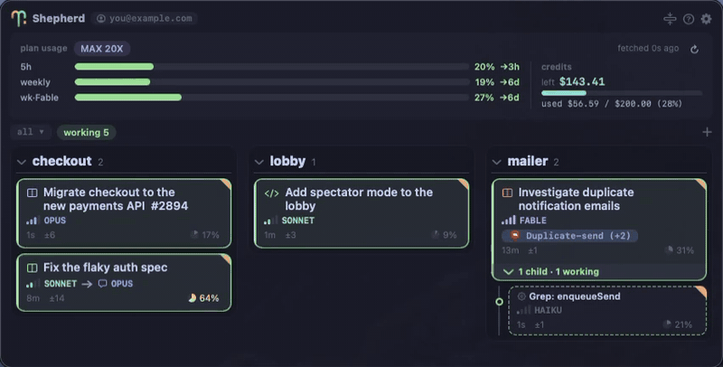
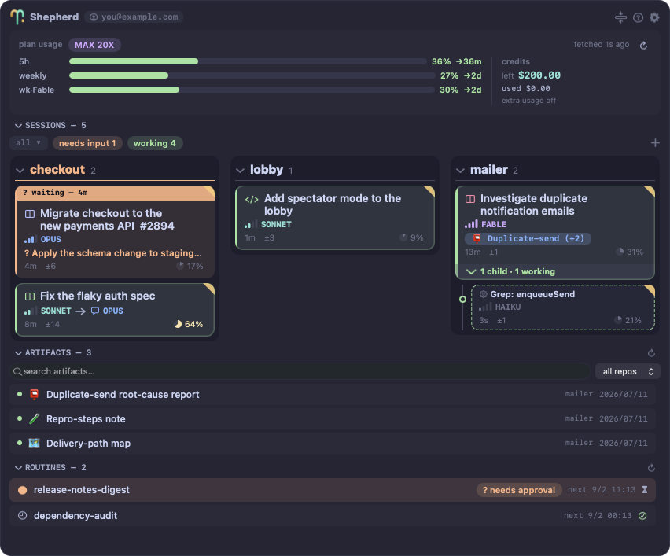

<p align="center">
  
</p>

<h1 align="center">Shepherd</h1>

A floating, always-on-top HUD for [Claude Code](https://claude.com/claude-code) — watch your flock of coding agents without opening a terminal.

<p align="center">
  
</p>

```sh
brew install --cask sadayuki-matsuno/tap/shepherd
```

> Gatekeeper may block the first launch (ad-hoc signature) — see [Install](#install).

Shepherd sits in the corner of your screen and shows every Claude Code session on the machine — zellij panes, VS Code integrated terminals, bare terminals and cc-daemon background workers alike, including sessions running under a separate `CLAUDE_CONFIG_DIR` (a second account, say): what it's doing, which repo/branch it's on, how many files it has changed, and which issue/PR it belongs to. Agents that need your input are impossible to miss.

**Docs:** [sadayuki-matsuno.github.io/shepherd](https://sadayuki-matsuno.github.io/shepherd/) — install, reading the board, actions, configuration · **Guide:** [The herding playbook](https://sadayuki-matsuno.github.io/shepherd/playbook.html) — vehicles, model tiering, and reading the board.

## Features

- **Always visible** — floats above every window and Space, drag it anywhere, position is remembered
- **Live status** — pushed by FSEvents on `~/.claude/sessions` (no polling, no hooks); agents sorted by urgency (needs input → working → idle). Sessions started with a different `CLAUDE_CONFIG_DIR` are picked up automatically — Shepherd finds the config dirs in use from the running processes themselves, so there is nothing to configure
- **Rich cards** — AI-generated task title behind a where-it-runs glyph (zellij panes, editor brackets, terminal window, bare headless prompt — hover for details) whose tint is the permission mode (lavender = plan, green = edits auto-accepted, amber = no-ask, red = bypass), then instruments that show *how* the session runs at a glance: tier bars + name for the model (1 bar = Haiku … 4 = Fable), "→ speech bubble + name" when an `--advisor` model is paired (the arrow reads "consults"), and a folder glyph + short name when the session runs under a non-default `CLAUDE_CONFIG_DIR` (hover for the full path; default-dir sessions show nothing there). Plus context-window pie (yellow ≥ 60%, red ≥ 85%), elapsed time, changed-file count, issue number, and the session's Artifacts (one badge; 2+ collapse to "newest (+N)" with a picker). The PR + CI state lives on the right-click menu
- **Family trees, not a flat list** — teammates, subagents and child sessions nest under their parent card while they work; finished background records fold into an archive lane
- **Click to open** — attaches the session's zellij tab and focuses its pane, raises the VS Code window a session's integrated terminal or Claude Code extension panel lives in (built to cover Cursor/Windsurf-style forks too, though those are untested), or opens a background worker's live TUI with `claude attach` in a new terminal window
- **Right-click menu** — per-card actions: reply (answer a blocked agent inline — over zellij, or over the cc-daemon control socket for a background worker; a VS Code terminal accepts no outside keystrokes, so click the card and answer in the editor instead), remote-control, capture a screen region and send it to that agent, and close (`claude stop` for a background agent, SIGTERM for an interactive one; guarded so a dirty working tree never loses uncommitted work)
- **Drop files onto a row** — copies them to a scratch dir and sends the paths (plus an optional message) to that agent
- **Artifact shelf** — the board carries a collapsible ARTIFACTS section: a persistent, account-wide list of your Claude Artifacts with search, a repo filter, and bookmark-style pinning (right-click → pin to top). It merges two sources: the account's own artifact listing (covers other machines and claude.ai, marks deleted ones dimmed — note it only returns the ~50 most recently updated) and an incremental scan of local transcripts (keeps everything ever published here, adds the favicon and repo attribution). Click a row to open it; right-click to copy the URL. The sessions board itself folds behind its own bar too (the status summary moves onto the bar), and a card's Artifact badge flashes amber when the session redeploys an artifact you may have open in a browser tab
- **Routines** — a collapsible ROUTINES section lists your [claude.ai routines](https://claude.ai/code/routines): the cron-scheduled agents that run in Anthropic's cloud rather than on this machine. Each row shows the routine's name, its next run in local time, and how the last one ended. A routine whose run has stopped at a permission prompt turns orange and says so — the same treatment a blocked session gets — and that count follows you: onto the section's bar when it's folded, and onto the minimized strip next to the local needs-input pill. A cloud agent waiting on you is as hard to miss as a local one. Click a row to open its latest run on claude.ai; right-click for the routine's own page
- **Update badge** — once a day Shepherd compares itself against the latest GitHub release; when a newer one exists, an "update vX.Y.Z" chip appears in the header. Click it to open the release page, then update with `brew upgrade --cask shepherd`
- **Zero deps** — plain Swift built with the Xcode Command Line Tools; no Xcode project, no packages

<p align="center">
  
</p>

## Requirements

- macOS 13+
- Xcode Command Line Tools (`xcode-select --install`) to build
- Optional: [Ghostty](https://ghostty.org) (preferred terminal; falls back to Terminal.app), [gh](https://cli.github.com) for PR badges

## Install

### Homebrew

```sh
brew install --cask sadayuki-matsuno/tap/shepherd
```

> The prebuilt app is ad-hoc signed (no Apple Developer ID yet), so macOS may block the first launch — right-click Shepherd.app → Open once, or add `--no-quarantine` to the install. Building from source avoids this entirely.

### From source

```sh
git clone https://github.com/sadayuki-matsuno/shepherd.git
cd shepherd
./build.sh          # builds + installs /Applications/Shepherd.app
open -a Shepherd
```

A prebuilt zip is also attached to each [GitHub Release](https://github.com/sadayuki-matsuno/shepherd/releases).

## No hooks, no configuration

Shepherd installs nothing into Claude Code. It reads what Claude Code already writes about itself:

- `~/.claude/sessions/<pid>.json` — every session's own live status (`busy` / `idle` / `waiting`, and what it is waiting for). Watched with FSEvents, so state changes repaint the board immediately.
- `claude agents --json --all` — the list of sessions, including finished background records.
- the cc-daemon control socket — for background workers: their state, what they are doing this turn, and what a blocked one needs to be told (it also takes your reply).
- the session's transcript — model, context usage, deliverable links, its AI-generated title, subagents, and API errors.
- the `api.anthropic.com/api/oauth/usage` endpoint, read with Claude Code's own OAuth token — the plan-usage dashboard: 5-hour / weekly windows, extra-usage credit spend, and the plan-tier chip (via `/api/oauth/profile`). Refresh on demand with the dashboard's ↻ button; a failed fetch keeps the last good numbers up, dimmed. While extra-usage credits are actively burning (the spend counter grew between snapshots, or a limit window is exhausted with extra usage enabled) the credits zone glows amber and an amber "on credits" chip appears in the header. Minimizing the HUD keeps the usage gauges and the count pills — only the credits column is dropped from the strip.
- the `api.anthropic.com/v1/code/triggers` and `/v1/code/sessions` endpoints, read with the same token — your routines and the state of their runs, which is the only way to see a cloud agent from here: a scheduled routine has no process, transcript or daemon job on this machine. Fetched every two minutes; a failed fetch keeps the last list, and the section simply says so.
- `ps -wwEp <pid>` — the session's environment: which zellij session and pane it lives in, whether it runs in a VS Code-family integrated terminal (`TERM_PROGRAM` / `__CFBundleIdentifier` — the latter is also the exact `open -b` target, so forks like Cursor need no lookup table), and the `SHEPHERD_PARENT_SESSION_ID` a parent exported when it spawned the session, which is how child sessions nest under their parent. (This variable is Shepherd's own convention — export it yourself when one session launches another.)

**Upgrading from a version that installed a hook?** Delete `~/.claude/hooks/shepherd-agent-status.sh` and `~/.claude/agent-status/`, and remove the `shepherd-agent-status.sh` entries from the `hooks` section of `~/.claude/settings.json`. (The `hooks/uninstall.sh` helper that automated this is gone — it's in the git history if you need it.)

## Configuration

All optional, via `defaults`:

```sh

# Terminal app used for jumping/opening directories (default: Ghostty if installed, else Terminal)
defaults write com.sadayuki-matsuno.shepherd terminalApp Ghostty

# Path to gh for PR badges; set to "" to disable PR lookup
defaults write com.sadayuki-matsuno.shepherd ghPath /opt/homebrew/bin/gh

# Start a board section folded. Normally set by clicking the section's bar, so this is only
# useful for pinning a launch state: sessionsCollapsed / artifactsBarCollapsed / routinesBarCollapsed
defaults write com.sadayuki-matsuno.shepherd routinesBarCollapsed -bool true
```

UI language follows your system language (Japanese / English).

## Stream Deck support

Shepherd can mirror the same board onto an [Elgato Stream Deck](https://www.elgato.com/stream-deck) — a physical status panel you can glance at and press to jump. The top screen shows one key per repo column (name, session count, status dots); press a column to drill into its sessions in urgency order, then press a session key to open it. Agents that need input **blink**.

Click the **⚙** button in the HUD header and choose **Use Stream Deck** to turn it on (the choice is remembered). No extra install — Shepherd talks to the device directly over USB HID.

- Tested on **Stream Deck MK.2** (15 keys); Original V2 uses the same protocol
- The official **Elgato Stream Deck app must be quit** first — it and Shepherd can't share the device (`osascript -e 'quit app "Elgato Stream Deck"'`)
- With several decks connected, Shepherd uses the first one. To pin a specific device by serial: `defaults write com.sadayuki-matsuno.shepherd deckSerial <serial>`

## How it works

Shepherd is a tiny AppKit app (one `NSPanel`, no Dock icon). A row's state comes from Claude Code's per-process registry (`~/.claude/sessions/`, see above), cross-checked against the cc-daemon control socket (which alone knows what a background worker is doing right now, and what a blocked one is waiting to be told). It is enriched by local `git` for branch/diff info, `gh` for PR/CI facts, the session's Claude Code transcript (model, context usage, deliverable links, pending questions), and `zellij` for jumping into / sending to zellij sessions.

## License

[MIT](LICENSE)
